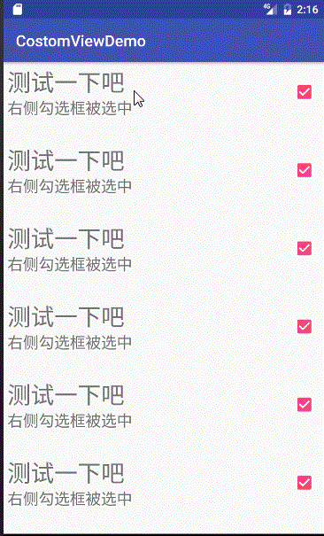
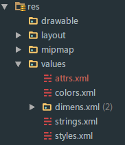

## 自定义View之自定义设置界面栏位

>这是学习自定义控件的第二个demo，这次的目的是实现一个简单的ScrollView，效果如下：

<<<<<<< HEAD:自定义view之自定义ScrollView.md

=======

>>>>>>> 6dd747a29b23665d668e3400f2899575b8f1d471:自定义view之自定义组合控件.md


### 1.初始化自定义控件
```java
/*
* 描    述：自定义ScrollView
* 作    者：ksheng
* 时    间：2017/3/30$ 22:55$.
*/
public class CostomScrollView extends ViewGroup {
    private Scroller scroller;
    private int childCount;//自动view的数量
    private int lastY;
    private int downY;//ACTION_DOWN时候的Y坐标
    private int moveY;//ACTION_MOVE时候的Y坐标
    private int topBorder;//拖动时候的上边界
    private int bottomBorder;//拖动时候的下边界
    private int touchGap;//可以识别的最小拖动距离
    private int scrolledY;//一次操作滑动的Y距离
    private int childHeight;//子view的高度（这个demo强制设置为100dp）

    public CostomScrollView(Context context) {
        super(context);
        mInit(context);
    }

    public CostomScrollView(Context context, AttributeSet attrs) {
        super(context, attrs);
        mInit(context);
    }

    public CostomScrollView(Context context, AttributeSet attrs, int defStyleAttr) {
        super(context, attrs, defStyleAttr);
        mInit(context);
    }

    private void mInit(Context context) {
        scroller = new Scroller(context);
        touchGap = ViewConfiguration.get(context).getScaledTouchSlop();
    }
}
```
下面是布局文件：

```xml
<com.skkk.ww.costomviewdemo.CostomScrollView
        android:layout_width="match_parent"
        android:layout_height="wrap_content">

        <com.skkk.ww.costomviewdemo.ComboBox
            android:id="@+id/cb_test"
            combo:title="这里是我们定义的标题"
            combo:checkedContent="选中了，wow！"
            combo:unCheckContent="没被选中，好烦躁！"
            combo:ischeck="true"
            android:layout_width="match_parent"
            android:layout_height="100dp" />

        <com.skkk.ww.costomviewdemo.ComboBox
            combo:title="测试一下吧"
            combo:checkedContent="右侧勾选框被选中"
            combo:unCheckContent="右侧勾选框取消选中"
            combo:ischeck="true"
            android:layout_width="match_parent"
            android:layout_height="100dp" />
<<<<<<< HEAD:自定义view之自定义ScrollView.md

        <com.skkk.ww.costomviewdemo.ComboBox
            combo:title="测试一下吧"
            combo:checkedContent="右侧勾选框被选中"
            combo:unCheckContent="右侧勾选框取消选中"
            combo:ischeck="true"
            android:layout_width="match_parent"
            android:layout_height="100dp" />
=======
</LinearLayout>  
```
其实这个时候运行项目就可以显示出自定义view了，但是我没什么都没有设置，所以只是一片空白；

### 3.自定义view布局
- 自定义view布局

  ```xml
  <?xml version="1.0" encoding="utf-8"?>
  <LinearLayout xmlns:android="http://schemas.android.com/apk/res/android"
      android:layout_width="match_parent"
      android:layout_height="wrap_content"
      android:orientation="horizontal">

      <LinearLayout
          android:id="@+id/ll_left"
          android:layout_weight="1"
          android:layout_margin="5dp"
          android:layout_width="match_parent"
          android:layout_height="wrap_content"
          android:orientation="vertical">
          <TextView
              android:id="@+id/tv_title_cb"
              android:text="Title"
              android:textSize="30dp"
              android:layout_width="match_parent"
              android:layout_height="wrap_content" />

          <TextView
              android:id="@+id/tv_content_cb"
              android:textSize="20dp"
              android:text="Content"
              android:layout_width="match_parent"
              android:layout_height="wrap_content" />
      </LinearLayout>

      <CheckBox
          android:id="@+id/cb_select_cb"
          android:layout_marginRight="10dp"
          android:layout_gravity="center"
          android:layout_width="wrap_content"
          android:layout_height="match_parent" />

  </LinearLayout>
  ```

- 引用布局

  ```java
  private void initUI(Context context) {
      LayoutInflater.from(context).inflate(R.layout.layout_combobox,this,true);
      tvTitle= (TextView) findViewById(R.id.tv_title_cb);
      tvContent= (TextView) findViewById(R.id.tv_content_cb);
      cbCombo= (CheckBox) findViewById(R.id.cb_select_cb);
      llLeft= (LinearLayout) findViewById(R.id.ll_left);
  }
  ```
  当然```initUI```方法还需要加入到构造方法中，不然就没效果了。

  

### 4.自定义属性
  >**通过以上的操作我们就可以得到一个像模像样的设置栏位了，当然，所有的属性我们都需要在java文件中修改，这不是我们想要的，我们如何才能向正常的控件一样在xml中定义各种属性呢？这就需要用的自定义属性了。**

- 定义属性

    1.首先我们需要新建一个文件```attrs.xml```,如下图所示：

    
>>>>>>> 6dd747a29b23665d668e3400f2899575b8f1d471:自定义view之自定义组合控件.md

        <com.skkk.ww.costomviewdemo.ComboBox
            combo:title="测试一下吧"
            combo:checkedContent="右侧勾选框被选中"
            combo:unCheckContent="右侧勾选框取消选中"
            combo:ischeck="true"
            android:layout_width="match_parent"
            android:layout_height="100dp" />

    </com.skkk.ww.costomviewdemo.CostomScrollView>
```
这里使用了我自定义的一个组合控件[CostomScrollView](img\自定义view之自定义组合控件.md)

**初始化很简单，但是需要注意的是我们通过```ViewConfiguration.get(context).getScaledTouchSlop()```方法来获取在可以被识别的最小滑动距离。**

### 2.测量与布局

- 测量

  **对每一个子view进行测量**
  ```java
  @Override
  protected void onMeasure(int widthMeasureSpec, int heightMeasureSpec) {
      super.onMeasure(widthMeasureSpec, heightMeasureSpec);
      childCount = getChildCount();
      for (int i = 0; i < childCount; i++) {
          measureChild(getChildAt(i), widthMeasureSpec, heightMeasureSpec);
      }
  }
  ```
<<<<<<< HEAD:自定义view之自定义ScrollView.md

- 布局
=======
  这样我们可以在xml中定义我们的属性了，效果如下：

  

  
>>>>>>> 6dd747a29b23665d668e3400f2899575b8f1d471:自定义view之自定义组合控件.md

  **因为我们把所有的子view都设置为高度一致，所以如下进行布局**
  ```java
  @Override
  protected void onLayout(boolean changed, int l, int t, int r, int b) {
      if (changed) {
          childCount = getChildCount();
          for (int i = 0; i < childCount; i++) {
              View childView = getChildAt(i);
              childView.layout(0, i * childView.getMeasuredHeight(),
                      childView.getMeasuredWidth(), (i + 1) * childView.getMeasuredHeight());
          }
          topBorder = getChildAt(0).getTop();
          bottomBorder = getChildAt(childCount - 1).getTop();
          childHeight = getChildAt(0).getHeight();
          scrollTo(0,topBorder);
      }
  }
  ```
  在布局完成之后我们需要获取如下几个属性：
  1.topBorder：第一个View的上边界
  2.bottomBorder：最后一个View的上边界
  3.childHeight：子View的高度
  4.view定位在上边界

  在布局完成之后我们运行项目就可以显示出效果了：

  


### 3.触摸拦截

在进行最核心重写触摸事件之前，我们需要进行一下触摸拦截：只有当我们触摸垂直距离达到了可以识别的最小滑动距离时候，我们将其拦截，避免传递到子View中。
```java
@Override
public boolean onInterceptTouchEvent(MotionEvent ev) {
    switch (ev.getAction()) {
        case MotionEvent.ACTION_DOWN:
            downY = (int) ev.getRawY();
            lastY = downY;
            break;
        case MotionEvent.ACTION_MOVE:
            moveY = (int) ev.getRawY();
            int diff = Math.abs(moveY - downY);
            lastY = downY;
            if (diff > touchGap) {
                return true;
            }
            break;
    }
    return super.onInterceptTouchEvent(ev);
}
```

### 4.触摸事件

经过上面的拦截，这里我们接受到的事件就只有我们指定的滑动类型了。

```java
@Override
public boolean onTouchEvent(MotionEvent event) {
    switch (event.getAction()) {
        case MotionEvent.ACTION_DOWN:
            downY = (int) ev.getRawY();
            lastY = downY;
            return true;
        case MotionEvent.ACTION_MOVE:
            moveY = (int) event.getRawY();
            scrolledY = lastY - moveY;
            scrollBy(0, scrolledY);
            lastY = moveY;
            break;
        case MotionEvent.ACTION_UP:
            int index = (getScrollY() + childHeight / 2) / childHeight;
            int dy = index * childHeight - getScrollY();
            if (getScrollY() < topBorder) {
                dy=topBorder-getScrollY();
            }
            if (getScrollY() > bottomBorder) {
                dy=bottomBorder-getScrollY();
            }
            scroller.startScroll(0, getScrollY(), 0, dy);
            invalidate();
    }
    return super.onTouchEvent(event);
}
```
这里是滑动的核心，分析一下：首先是```ACTION_DOWN```事件我们需要返回为true，因为我们选择继承了```ViewGroup```而```ViewGroup```默认返回false，当我们的子View是```ImageView```或者```TextView```这种意识默认为false的控件时候，```ACTION_DOWN```事件就无法被消费，造成触摸无效的问题；然后我们进入到```ACTION_MOVE```事件中，首先我们从获取到从按下，到移动Y轴上滑动的距离```scrolledY```然后通过调用方法```scrolledBy(x,y)```来实现界面跟随手指的滑动，然后在```ACTION_UP```事件，也就是手指抬起的时候进行如下处理，首先我们需要获取到目前已经滑到了哪一个View,```getScrollY()```方法获取目前整个View滑动的距离，然后我们加上子View的1/2的高度，再除以子View的高度，通过强制转换为```int```来获取目前滑动处在哪一个子View，并且，如果根据是否滑过了子View的一半来判断是否下滑一个或者腿弹回去；确定了需要显示在第几个View位置之后，我们使用```int dy = index * childHeight - getScrollY();```来获得我们的View需要调整的距离；当然我这里设置了一个条件，如果当前滑动道具y坐标小于了上边界```topBorder```,那么我必定返回到上边界位置，下边界类似；最后我们调用```Scroller```的```startScroll(startX,startY,dx,dy)```方法来完成移动，并且刷新View；

### 5.复写```computeScroll()```方法

既然使用了Scroller我们就需要复写```computeScroll()```方法，如下：
```java
@Override
public void computeScroll() {
    if (scroller.computeScrollOffset()) {
        scrollTo(scroller.getCurrX(), scroller.getCurrY());
        invalidate();
    }
}
```

### 6.头部刷新栏位

在一开始的动图中，我们可以看到，在下拉刷新的时候，会有一个类似于下拉刷新的样式，这个是如何实现的呢？其实很简单，我们在目前的布局第一个子View前面再加上一个View，如下：
```xml
<com.skkk.ww.costomviewdemo.CostomScrollView
        android:layout_width="match_parent"
        android:layout_height="wrap_content">

        <ImageView
            android:scaleType="fitXY"
            android:layout_width="match_parent"
            android:layout_height="100dp"
            android:src="@mipmap/ic_launcher"
            />
        <com.skkk.ww.costomviewdemo.ComboBox
            android:id="@+id/cb_test"
            combo:title="这里是我们定义的标题"
            combo:checkedContent="选中了，wow！"
            combo:unCheckContent="没被选中，好烦躁！"
            combo:ischeck="true"
            android:layout_width="match_parent"
            android:layout_height="100dp" />
```
然后我们在布局完成之后，强制将View定位到第二个子View的头部，当然，我们仅仅需修改我们的上边界，topBorder就可以了：
```java
topBorder = getChildAt(1).getTop();
```
这样就完成了动图中显示的下拉刷新样式，是不是很简单呢？下一篇我们就正式完成一个下拉刷新的demo；

### 7.源码传送门

  [我是一只咸鱼，不想承认，也不能否认，不要同情我笨，又夸我天真，还梦想着翻身...](https://github.com/mhgd3250905/CostomViewDemo)
